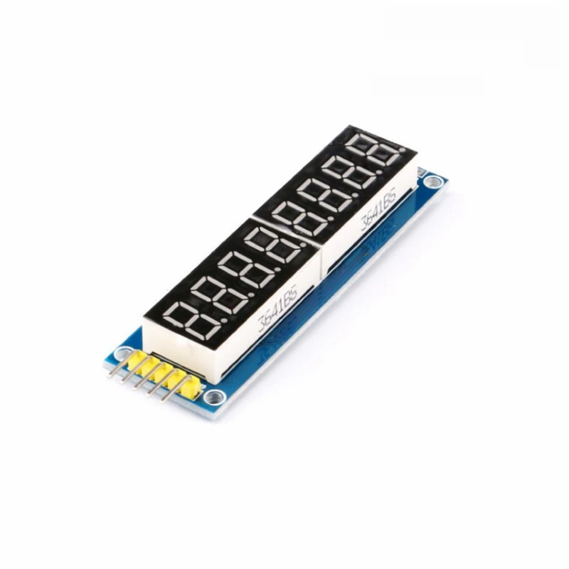

# LEDDisplay - 74HC595 数码管驱动

一个使用标准 C 编写的轻量级 74HC595 数码管驱动。通过两片 74HC595 级联实现段选和位选控制，支持 4 位或 8 位共阳数码管动态扫描显示，并可通过 3 个 GPIO 适配函数接入不同 MCU 平台。

> 重要：当前 `LEDDisplay.c` 中的 `Set_LE()`、`Set_CLK()`、`Set_Dat()` 默认留空，只保留 STM32 HAL 示例注释。使用前必须实现这 3 个函数，否则驱动不会产生任何 GPIO 输出。



## 目录

- [项目特点](#项目特点)
- [当前代码状态](#当前代码状态)
- [源码结构](#源码结构)
- [工作原理](#工作原理)
- [硬件连接](#硬件连接)
- [快速开始](#快速开始)
- [STM32 HAL 接入示例](#stm32-hal-接入示例)
- [API 说明](#api-说明)
- [段码表](#段码表)
- [移植说明](#移植说明)
- [注意事项](#注意事项)
- [常见问题](#常见问题)
- [设计限制](#设计限制)

## 项目特点

- 使用 3 个 GPIO 模拟 74HC595 串行时序，不依赖 SPI 外设。
- 两片 74HC595 级联，分别控制段选和位选。
- 提供 `LED4_Display()` 和 `LED8_Display()` 两个显示接口。
- 内置段码表，支持数字 `0-9`、字母 `A-F` 和负号 `-`。
- 不依赖 STM32 HAL、Arduino 或其他平台框架，核心逻辑只依赖 `stdint.h`。
- 通过 `Set_LE()`、`Set_CLK()`、`Set_Dat()` 三个函数完成平台适配。
- 不进行动态内存分配，代码结构简单，便于集成到裸机或 RTOS 工程。

## 当前代码状态

`LEDDisplay.c` 顶部的 GPIO 适配函数目前是空实现：

```c
static void Set_LE(uint8_t value)
{
    //HAL_GPIO_WritePin(GPIOF, GPIO_PIN_2, value);
}

static void Set_CLK(uint8_t value)
{
    //HAL_GPIO_WritePin(GPIOF, GPIO_PIN_1, value);
}

static void Set_Dat(uint8_t value)
{
    //HAL_GPIO_WritePin(GPIOF, GPIO_PIN_0, value);
}
```

这些函数中的 `PF0`、`PF1`、`PF2` 只是 STM32 示例，不是当前生效的硬编码引脚。集成时可以直接取消注释，也可以改成目标平台对应的 GPIO 操作。

## 源码结构

```text
LEDDisplay_74HC595/
|-- LEDDisplay.c     移位时序、段码表、显示扫描和 GPIO 适配函数
|-- LEDDisplay.h     对外 API
|-- img.jpg          实物显示效果
`-- README.md        项目说明
```

本仓库只包含驱动源码，不包含完整的 MCU 工程、启动文件、链接脚本或平台驱动。

## 工作原理

驱动使用动态扫描方式显示多位数字：

1. 读取显示缓冲区中的一个元素，并通过 `LED_0F[]` 获取段码。
2. 将 8 位段码串行写入段选移位寄存器。
3. 将当前数码管的位选值串行写入位选移位寄存器。
4. 拉低再拉高 `STCP`，将移位寄存器内容锁存到并行输出。
5. 依次扫描每一位，利用人眼视觉暂留形成多位同时显示的效果。

核心扫描代码：

```c
static void LED_Display_N(uint8_t *LED, uint8_t n)
{
    uint8_t i;

    for (i = 0; i < n; i++)
    {
        LED_OUT(LED_0F[LED[i]]);
        LED_OUT(1 << i);
        Set_LE(0);
        Set_LE(1);
    }
}
```

`LED_OUT()` 从最高位开始发送数据，每写入 1 bit 都会产生一次 `SHCP` 时钟脉冲：

```c
static void LED_OUT(uint8_t X)
{
    uint8_t i;

    for (i = 8; i >= 1; i--)
    {
        Set_Dat((X & 0x80) ? 1 : 0);
        X <<= 1;
        Set_CLK(0);
        Set_CLK(1);
    }
}
```

段码字节先写入，位选字节后写入。因此，接线时必须确认段码最终出现在段选 595 的输出端，位选最终出现在位选 595 的输出端。

## 硬件连接

### GPIO 适配关系

| 74HC595 信号 | 74HC595 引脚 | 适配函数 | 示例 GPIO | 说明 |
| --- | ---: | --- | ---: | --- |
| `DS` / `SER` | 14 | `Set_Dat()` | `PF0` | 串行数据输入 |
| `SHCP` / `SRCLK` | 11 | `Set_CLK()` | `PF1` | 移位时钟，上升沿采样数据 |
| `STCP` / `RCLK` | 12 | `Set_LE()` | `PF2` | 锁存时钟，上升沿更新输出 |
| `Q7S` | 9 | - | - | 连接下一片 74HC595 的 `DS` |
| `MR` | 10 | - | - | 正常工作时接高电平 |
| `OE` | 13 | - | - | 正常工作时接低电平 |
| `VCC` | 16 | - | - | 按芯片和模块规格供电 |
| `GND` | 8 | - | - | 与 MCU 共地 |

示例 GPIO 来自源码注释，不要求必须使用。只要正确实现 3 个适配函数，任意可输出高低电平的 GPIO 均可使用。

### 级联关系

两片 74HC595 的 `SHCP` 和 `STCP` 可以并联，由同一组 GPIO 控制：

```text
MCU Set_Dat  ----> 第一片 74HC595 DS
MCU Set_CLK  ----> 两片 74HC595 SHCP
MCU Set_LE   ----> 两片 74HC595 STCP
第一片 Q7S   ----> 第二片 DS
```

不同数码管模块可能已经在 74HC595 和数码管之间增加三极管、MOSFET 或其他驱动电路。实际接线应以模块原理图为准。

### 上电检查

- 74HC595 的 `OE` 不能悬空，正常显示时应为低电平。
- 74HC595 的 `MR` 不能悬空，正常工作时应为高电平。
- MCU 与 74HC595 模块必须共地。
- 建议在每个 74HC595 的 `VCC` 和 `GND` 之间放置 `100 nF` 去耦电容。
- 使用裸数码管时，应确认限流电阻和驱动能力满足要求。

## 快速开始

### 1. 添加源文件

将以下文件加入目标工程：

```text
LEDDisplay.c
LEDDisplay.h
```

确保编译器可以找到 `LEDDisplay.h`，并确认目标工具链支持 `stdint.h`。

### 2. 实现 GPIO 适配函数

打开 `LEDDisplay.c`，根据自己的平台实现以下 3 个函数：

```c
static void Set_LE(uint8_t value)
{
    /* 将 STCP 设置为 value，value 只会是 0 或 1 */
}

static void Set_CLK(uint8_t value)
{
    /* 将 SHCP 设置为 value，value 只会是 0 或 1 */
}

static void Set_Dat(uint8_t value)
{
    /* 将 DS 设置为 value，value 只会是 0 或 1 */
}
```

每个函数都必须真正改变对应 GPIO 的输出电平，不能保留为空函数。

### 3. 配置 GPIO

将 3 个 GPIO 配置为普通推挽输出。以 STM32CubeMX 为例：

| 配置项 | 建议值 |
| --- | --- |
| GPIO mode | Output Push Pull |
| Pull-up / Pull-down | No pull |
| Output speed | Medium，长线或干扰较大时适当调整 |
| Initial level | Low |

如果使用开漏输出，需要在外部增加上拉电阻，并确认上升沿满足 74HC595 的时序要求。

### 4. 持续刷新显示

4 位数码管示例：

```c
#include "LEDDisplay.h"

uint8_t display_buffer[4] = {1, 2, 3, 4};

while (1)
{
    LED4_Display(display_buffer);
    HAL_Delay(1);
}
```

8 位数码管示例：

```c
#include "LEDDisplay.h"

uint8_t display_buffer[8] = {0, 1, 2, 3, 4, 5, 6, 7};

while (1)
{
    LED8_Display(display_buffer);
    HAL_Delay(1);
}
```

`LED4_Display()` 和 `LED8_Display()` 每次调用都会完整扫描一次缓冲区。必须在主循环、周期任务或定时器中持续调用，不能只在显示内容变化时调用一次。

推荐刷新周期为 `1-2 ms`。具体周期可根据亮度、闪烁和系统负载调整。

## STM32 HAL 接入示例

在 STM32CubeMX 工程中，可以在 `LEDDisplay.c` 顶部加入 HAL 头文件：

```c
#include "stdint.h"
#include "main.h"
```

然后实现 GPIO 适配函数：

```c
static void Set_LE(uint8_t value)
{
    HAL_GPIO_WritePin(GPIOF, GPIO_PIN_2, value);
}

static void Set_CLK(uint8_t value)
{
    HAL_GPIO_WritePin(GPIOF, GPIO_PIN_1, value);
}

static void Set_Dat(uint8_t value)
{
    HAL_GPIO_WritePin(GPIOF, GPIO_PIN_0, value);
}
```

以上代码使用 `PF0`、`PF1`、`PF2`，可按实际硬件替换端口和引脚。若目标工程已有统一 GPIO 封装，也可以直接调用封装层，而不使用 `HAL_GPIO_WritePin()`。

## API 说明

### `LED4_Display`

```c
void LED4_Display(uint8_t *LED);
```

刷新 4 位数码管。`LED` 必须指向长度至少为 4 的有效缓冲区。

### `LED8_Display`

```c
void LED8_Display(uint8_t *LED);
```

刷新 8 位数码管。`LED` 必须指向长度至少为 8 的有效缓冲区。

### 参数约束

缓冲区中的每个元素是段码表索引，不是字符本身：

| 缓冲区值 | 显示内容 |
| ---: | --- |
| `0-9` | 数字 `0-9` |
| `10-15` | 字母 `A-F` |
| `16` | 负号 `-` |

示例：

```c
uint8_t value[4] = {1, 2, 10, 16};
/* 显示效果：12A- */
LED4_Display(value);
```

注意事项：

- 每个元素必须位于 `0-16` 范围内。
- 传入超范围值会越界访问 `LED_0F[]`，属于未定义行为。
- 函数内部不会检查空指针。
- 函数内部不会检查缓冲区长度。
- 驱动只读取缓冲区，不会修改缓冲区内容。

## 段码表

当前段码表使用低电平点亮，适用于共阳数码管或等效的低电平有效段选电路：

```c
static const uint8_t LED_0F[] = {
    0xC0, 0xF9, 0xA4, 0xB0, 0x99, 0x92, 0x82, 0xF8,  // 0~7
    0x80, 0x90, 0x8C, 0xBF, 0xC6, 0xA1, 0x86, 0xFF,  // 8~F
    0xBF                                                // '-'
};
```

| 索引 | 显示 | 段码 | 索引 | 显示 | 段码 |
| ---: | :---: | ---: | ---: | :---: | ---: |
| 0 | 0 | `0xC0` | 8 | 8 | `0x80` |
| 1 | 1 | `0xF9` | 9 | 9 | `0x90` |
| 2 | 2 | `0xA4` | 10 | A | `0x8C` |
| 3 | 3 | `0xB0` | 11 | B | `0xBF` |
| 4 | 4 | `0x99` | 12 | C | `0xC6` |
| 5 | 5 | `0x92` | 13 | D | `0xA1` |
| 6 | 6 | `0x82` | 14 | E | `0x86` |
| 7 | 7 | `0xF8` | 15 | F | `0xFF` |
| 16 | - | `0xBF` | - | - | - |

如果数码管的段顺序、公共端极性或位选逻辑不同，需要根据实际硬件重新计算段码或调整位选值。

## 移植说明

### 更换 GPIO

只需要修改 `LEDDisplay.c` 中的 3 个适配函数：

```c
static void Set_LE(uint8_t value)
{
    /* STCP 输出 */
}

static void Set_CLK(uint8_t value)
{
    /* SHCP 输出 */
}

static void Set_Dat(uint8_t value)
{
    /* DS 输出 */
}
```

不要修改 `LED_OUT()` 和 `LED_Display_N()` 中的时序顺序，除非目标硬件使用了不同的级联方向或驱动方式。

### 使用其他位数

当前驱动以 `uint8_t` 保存位选数据，`1 << i` 可覆盖 8 个位选通道。对于其他位数，可以增加接口：

```c
void LED6_Display(uint8_t *LED)
{
    LED_Display_N(LED, 6);
}
```

要求：

- 显示位数不能超过 8，否则 `1 << i` 无法继续表示位选。
- 缓冲区长度必须不小于显示位数。
- 如果超过 8 位，需要扩展位选数据类型并继续级联 74HC595，或增加译码电路。

### 共阴数码管

当前段码为低电平点亮。共阴数码管通常需要高电平点亮段选，因此至少需要：

1. 将段码表按位取反，例如 `0xC0` 变为 `~0xC0`。
2. 根据共阴模块的位选驱动电路，调整 `LED_OUT(1 << i)` 的有效电平。
3. 确认 74HC595 的输出电流能力满足亮度要求。

不能只修改段码而忽略位选极性。建议先根据模块原理图确认段选和位选的有效电平。

## 注意事项

### 使用前必须实现 GPIO 函数

当前仓库中的 3 个 `Set_*` 函数默认是空实现。未实现时，程序可以编译，但不会输出任何有效时序，因此数码管不会显示。

### 3.3 V MCU 驱动 5 V 74HC595

74HC595 在 `5 V` 供电时，高电平输入门限约为 `0.7 x VCC`，即 `3.5 V`。`3.3 V` GPIO 可能无法保证被可靠识别为高电平。

建议使用以下方案之一：

- 使用具有 TTL 电平兼容能力的 `74HCT595`。
- 在 MCU 和 74HC595 之间增加电平转换电路。
- 按规范将 74HC595 使用 `3.3 V` 供电，并确认数码管及相关电路满足要求。

### 刷新与闪烁

- 只调用一次显示函数时，最终只会保留最后一次锁存的位。
- 调用间隔过长会造成明显闪烁。
- 长时间阻塞其他任务会影响系统实时性，建议使用固定的 `1-2 ms` 周期刷新。
- 不建议同时从主循环和中断调用显示函数。
- 如果多个任务共享显示缓冲区，应增加互斥保护或采用双缓冲。

### 亮度与功耗

- 动态扫描会降低每位数字的平均点亮时间。
- 不要通过超出额定电流的方式强行提高亮度。
- 多位数码管建议使用三极管、MOSFET 或专用位选驱动。
- 每位数码管都应配置合适的限流电阻。
- 74HC595 的电源引脚附近应放置去耦电容。

### 时序与信号完整性

- `SHCP` 上升沿用于移位，`STCP` 上升沿用于锁存。
- GPIO 输出速度过高、连线过长或地线不完整时，可能出现振铃和误触发。
- 如果出现随机错位，可降低 GPIO 输出速度、缩短连线并改善接地。
- 不建议在没有依据的情况下随意加入较长延时，应先检查硬件连接和时序。

## 常见问题

### 完全没有显示

- 检查 3 个 `Set_*` 函数是否已经实现。
- 检查 MCU 与 74HC595 是否共地。
- 检查 `OE` 是否为低电平，`MR` 是否为高电平。
- 检查 `DS`、`SHCP`、`STCP` 是否连接到代码中对应的 GPIO。
- 检查程序是否持续调用 `LED4_Display()` 或 `LED8_Display()`。
- 使用示波器或逻辑分析仪检查 `SHCP` 和 `STCP` 是否有脉冲。

### 只有一位亮或显示位置错误

- 检查两片 74HC595 的级联顺序。
- 检查第一片 `Q7S` 是否连接到第二片 `DS`。
- 检查位选值 `1 << i` 是否与模块位选顺序一致。
- 如果显示顺序相反，可以修改位选映射或调整硬件连接。

### 显示闪烁

- 缩短显示函数的调用间隔。
- 检查主循环或任务中是否存在长时间阻塞操作。
- 确认没有多个任务或中断同时操作同一组 GPIO。

### 字符缺段或段码错误

- 检查 `a-g`、`dp` 与 74HC595 输出位的对应关系。
- 确认数码管为共阳还是共阴。
- 确认模块是否增加了反相或驱动电路。
- 根据实际段顺序重新生成 `LED_0F[]`。

### 出现残影或串位

- 保持稳定的刷新周期，避免某一位显示时间过长。
- 检查数码管是否存在漏电流或位选驱动关闭不彻底。
- 必要时在切换位选前先关闭段选，完成锁存后再打开下一位。
- 检查电源和地线是否存在较大压降或干扰。

## 设计限制

- 当前 `Set_*` 函数为空实现，必须完成平台适配后才能使用。
- 当前位选数据使用 `uint8_t`，原生支持最多 8 位。
- 当前接口不检查空指针、缓冲区长度或段码索引范围。
- 当前实现没有自动定时刷新，需要调用者周期性执行。
- 当前实现没有显式的消隐步骤，特定硬件上可能需要增加空位信号。
- 当前段码表只覆盖 `0-9`、`A-F` 和 `-`。

## 兼容性

- 语言：C
- 必需头文件：`stdint.h`
- GPIO 数量：3 路普通输出
- 移位寄存器：2 片 74HC595 或兼容器件
- 显示器件：4 位或 8 位共阳数码管模块
- 平台示例：STM32 HAL

驱动核心不依赖 STM32 HAL。只要目标平台能够通过 `Set_LE()`、`Set_CLK()` 和 `Set_Dat()` 输出高低电平，就可以使用该驱动。
